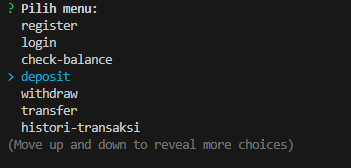
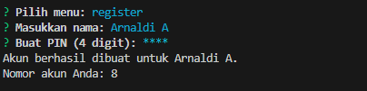
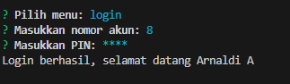
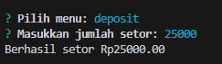
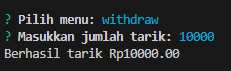
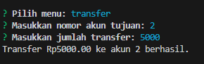
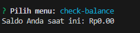
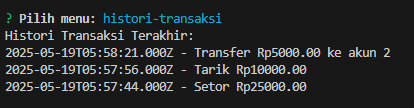
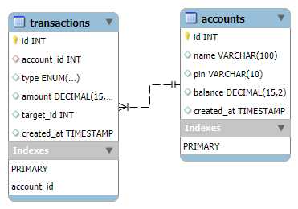

# ATM CLI Simulation

An Indonesian command-line based ATM simulation application built using Node.js and MySQL.
Created as a practice project for Digital Skill Fair 39.0.

## Features
- Register Account (Name, PIN)
- Login to account
- Check balance (`check-balance`)
- Deposit funds (`deposit`)
- Withdraw cash (`withdraw`)
- Transfer funds between accounts (`transfer`)
- View transaction history (`histori-transaksi`)

## Tools
- Node.js + Commander.js
- MySQL (via MySQL2)
- Inquirer CLI
- MySQL Workbench (for database design)

##  How to Run
1. Clone repository
2. Install dependency on your terminal: npm install
3. Import data `atm.sql`
4. Run on your terminal: node atm.js

## Menu

## Register

## Login

## Deposit

## Withdraw

## Transfer

## Check Balance

## Transaction History

## Diagram Database

## Credits
- Arnaldi Arif
